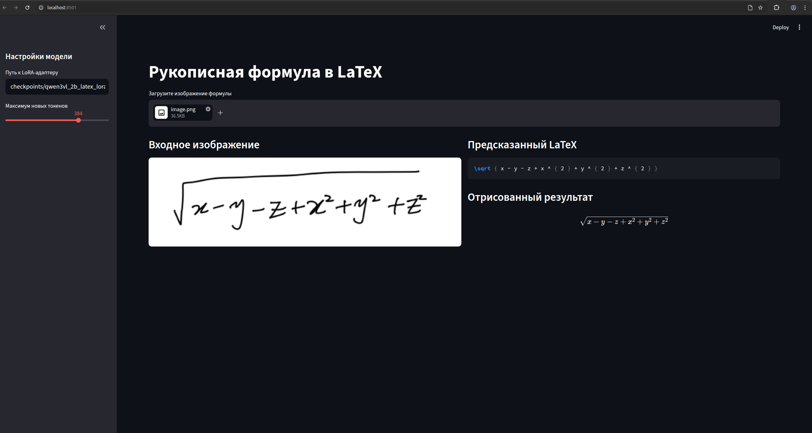
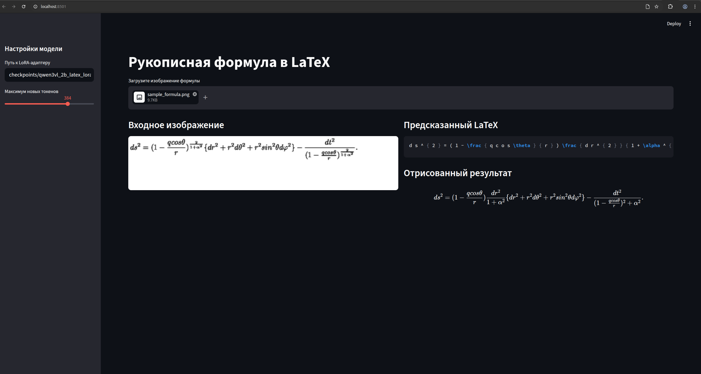

# Технический отчёт: рукописная формула в LaTeX

## О сервисе

Сервис использует fine-tuning Vision-Language Model для задачи распознавания рукописных математических формул:
обучение и оценка проводились на `linxy/LaTeX_OCR` test subset из 70 примеров.

Основные метрики:

| Метрика | Направление | Описание |
| --- | --- | --- |
| CER | ниже лучше | Character Error Rate после лёгкой нормализации LaTeX |
| Exact Match | выше лучше | полное совпадение нормализованных LaTeX-строк |

Лучшая модель: `Qwen/Qwen3-VL-2B-Instruct`, дообученная через LoRA masked SFT на 20000 примерах из `linxy/LaTeX_OCR`. С исправленным decoding она достигла mean CER = 0.0602 и Exact Match = 0.4571 на test subset из 70 примеров.

## Настройки эксперемента

Все supervised-запуски использовали формат:

```text
image + "Convert the formula in the image to LaTeX. Return only LaTeX." -> target LaTeX
```

Использовался masked SFT: loss считался только по assistant tokens. Prompt tokens, image placeholder tokens и padding tokens маскировались через `-100`.

## Эксперименты

### Эксперимент 1: SmolVLM baseline

| Поле | Значение |
| --- | --- |
| Model | `HuggingFaceTB/SmolVLM-256M-Instruct` |
| Training data | `linxy/LaTeX_OCR` |
| Train samples | 5000 |
| Fine-tuning | LoRA masked SFT |
| LoRA rank / alpha | 16 / 32 |
| Learning rate | `1e-4` |
| Epochs | 1 |
| Precision | fp16 |

Initial evaluation:

| CER | Exact Match |
| ---: | ---: |
| 0.4244 | 0.0143 |

SmolVLM научилась генерировать LaTeX-подобные ответы, но качество было слабым. Модель часто распознавала локальные символы, но ошибалась в структуре формулы: вложенные дроби, степени и тд.

### Эксперимент 2: Qwen3-VL-2B, 100 samples

| Поле | Значение |
| --- | --- |
| Model | `Qwen/Qwen3-VL-2B-Instruct` |
| Training data | `linxy/LaTeX_OCR` |
| Train samples | 100 |
| Fine-tuning | LoRA masked SFT |
| Learning rate | `1e-4` |
| Epochs | 1 |
| Precision | fp16 |
| Checkpoint | `checkpoints/qwen3vl_2b_latex_lora_masked` |

| Decoding | CER | Exact Match |
| --- | ---: | ---: |
| initial | 0.3529 | 0.0000 |
| corrected | 0.1058 | 0.3143 |

Даже короткий SFT на 100 примерах с Qwen3-VL-2B существенно превзошёл SmolVLM baseline. Это показало, что более крупная VLM имеет гораздо более сильные prior abilities для распознавания формул.

### Эксперимент 3: Qwen3-VL-2B, 5k samples

| Поле | Значение |
| --- | --- |
| Model | `Qwen/Qwen3-VL-2B-Instruct` |
| Training data | `linxy/LaTeX_OCR` |
| Train samples | 5000 |
| Fine-tuning | LoRA masked SFT |
| Learning rate | `5e-5` |
| Epochs | 1 |
| Precision | fp16 |
| Checkpoint | `checkpoints/qwen3vl_2b_latex_lora_masked_v2` |

| Decoding | CER | Exact Match |
| --- | ---: | ---: |
| initial | 0.2654 | 0.0143 |
| corrected | 0.0644 | 0.4286 |

Переход от 100 к 5000 train examples дал сильное улучшение. CER снизился с 0.1058 до 0.0644, а Exact Match вырос с 31.4% до 42.9%.

### Эксперимент 4: Qwen3-VL-2B, 20k samples

| Поле | Значение |
| --- | --- |
| Model | `Qwen/Qwen3-VL-2B-Instruct` |
| Training data | `linxy/LaTeX_OCR` |
| Train samples | 20000 |
| Fine-tuning | LoRA masked SFT |
| Learning rate | `5e-5` |
| Epochs | 1 |
| Precision | fp16 |
| Checkpoint | `checkpoints/qwen3vl_2b_latex_lora_masked_20k` |

| Decoding | CER | Exact Match |
| --- | ---: | ---: |
| initial | 0.2643 | 0.0000 |
| corrected | **0.0602** | **0.4571** |

Финальный 20k checkpoint показал лучший результат. При этом прирост относительно 5k checkpoint оказался небольшим, поэтому текущий pipeline начинает насыщаться после первых нескольких тысяч task-specific examples.

## Проблема с расшифровкой и исправлением

Изначально evaluation и inference использовали слишком жёсткие параметры генерации:

```text
max_new_tokens = 64 / 128
repetition_penalty = 1.15 / 1.2
no_repeat_ngram_size = 3
```
Из за чего качество при изменении модели на модель с бОльшим количеством параметров или при увеличении датасета улучшалось, но не давало необходимого результата для MVP.
Также длинные формулы могли обрезаться из-за слишком маленького `max_new_tokens`.

Первичная evaluation недооценивала качество модели из-за restrictive decoding. После увеличения `max_new_tokens` и удаления no-repeat n-gram constraints модель стала генерировать более длинные и точные LaTeX-последовательности, что существенно улучшило CER и Exact Match.

## Основная таблица результатов

| Setup | Model | Train samples | LoRA rank | Decoding | CER | Exact Match |
| --- | --- | ---: | ---: | --- | ---: | ---: |
| Baseline SFT | `SmolVLM-256M-Instruct` | 5k | 16 | initial | 0.4244 | 0.0143 |
| SFT | `Qwen3-VL-2B-Instruct` | 100 | 16 | initial | 0.3529 | 0.0000 |
| SFT | `Qwen3-VL-2B-Instruct` | 5k | 16 | initial | 0.2654 | 0.0143 |
| SFT | `Qwen3-VL-2B-Instruct` | 20k | 32 | initial | 0.2643 | 0.0000 |
| SFT | `Qwen3-VL-2B-Instruct` | 100 | 16 | corrected | 0.1058 | 0.3143 |
| SFT | `Qwen3-VL-2B-Instruct` | 5k | 16 | corrected | 0.0644 | 0.4286 |
| SFT | `Qwen3-VL-2B-Instruct` | 20k | 32 | corrected | **0.0602** | **0.4571** |

## Качественный вывод

Финальная Qwen3-VL-2B LoRA модель хорошо освоила задачу handwritten formula -> LaTeX. Она уверенно распознаёт локальные элементы формул: дроби, степени, греческие буквы, скобки и повторяющиеся математические паттерны.

Основные оставшиеся ошибки связаны со сложной двумерной структурой формулы: вложенными дробями, областью действия степени/корня, длинными скобочными выражениями и неоднозначными рукописными символами.

## Ограничения

Увеличение выборки с 100 до 5000 дало большой прирост качества. Увеличение выборки с 5000 до 20000 и увеличение LoRA rank с 16 до 32 дали только небольшой дополнительный выигрыш. Это говорит о насыщении текущего pipeline около CER 0.06 на данной тестовой выборке из 70 примеров.

Дальнейшие улучшения, вероятно, потребуют дополнительных hardwriten latex данных, добавления обработки/очисти как обучающей выборки так и на инференсе и более крупной VLM.

## web ui streamlit

Приложение реализовано в `app/streamlit_app.py` и по умолчанию использует финальный Qwen3-VL-2B LoRA adapter.

Возможности:

- загрузка изображения рукописной формулы;
- отрисовка формулы через Streamlit.
- выбор модели

Запуск:

```bash
make streamlit
# streamlit run app/streamlit_app.py
```

## Назначение файлов

| Файл | Роль |
| --- | --- |
| `src/train.py` | обучение финального LoRA adapter |
| `src/evaluate.py` | evaluation на 70 test examples |
| `src/infer.py` | inference для одного изображения |
| `app/streamlit_app.py` | вебинтерфейс приложение |

## Покрытие требований

| Требование | Статус |
| --- | --- |
| Fine-tune VLM для handwritten formula image to LaTeX | выполнено |
| Использовать `linxy/LaTeX_OCR` test subset, 70 examples | выполнено |
| Предложить метрики качества | выполнено: CER, Exact Match |
| Сравнить SFT-эксперименты | выполнено |
| Streamlit app с trained model | выполнено |
| SFT на `linxy/LaTeX_OCR + deepcopy/MathWriting-human` | не выполнено |

результат на скриншоте:



## Future Improvements

1. Добавить subset `deepcopy/MathWriting-human` и сравнить с существующими результатами SFT.
2. Запустить zero-shot и one-shot Qwen3-VL baselines на тех же 70 test examples.
3. Попробовать `Qwen/Qwen3-VL-4B-Instruct`
4. Улучшить нормализацию, постобработку и предобработку данных.

## Финальный вывод

Эксперименты показывают понятную прогрессию от лёгкого SmolVLM baseline к более сильной Qwen3-VL-2B LoRA модели. SmolVLM baseline получил CER = 0.4244, а Qwen3-VL-2B после исправлений значительно улучшил результат: 100-example checkpoint достиг CER = 0.1058, 5k checkpoint достиг CER = 0.0644, а финальный 20k checkpoint показал лучший результат CER = 0.0602 и Exact Match = 45.7%.

Это подтверждает, что модель успешно выучила задачу распознавания рукописных формул, а оставшиеся ошибки в основном связаны со сложной структурой формул, а не с распознаванием простых символов.
